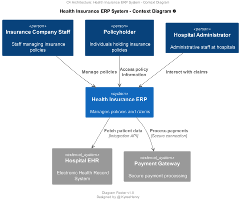

# Health Insurance ERP System

Welcome to the Health Insurance ERP System! This system is designed to manage health insurance claims efficiently.

## Overview

The Health Insurance ERP System is built on the principles of Clean Architecture, providing modularity, maintainability, and scalability. It uses .NET Core for backend development and follows the C4 architecture for system design.

## C4 Architecture Diagrams

### Level 1: System Context Diagram



### Level 2: Container Diagram


### Level 3: Component Diagram


### Level 3: Code Diagram


## Running the .NET Project

Follow the steps below to run the .NET project locally:

### Prerequisites

- [.NET Core SDK](https://dotnet.microsoft.com/download) installed on your machine.

### Steps

1. Clone the repository to your local machine:

    ```bash
    https://github.com/kyree-henry/HealthInsurePro.git
    ```

2. Navigate to the directory of the .NET project:

    ```bash
    cd HealthInsurePro
    ```

3. Restore NuGet packages:

    ```bash
    dotnet restore
    ```

4. Run the application:

    ```bash
    dotnet watch run
    ```
    
